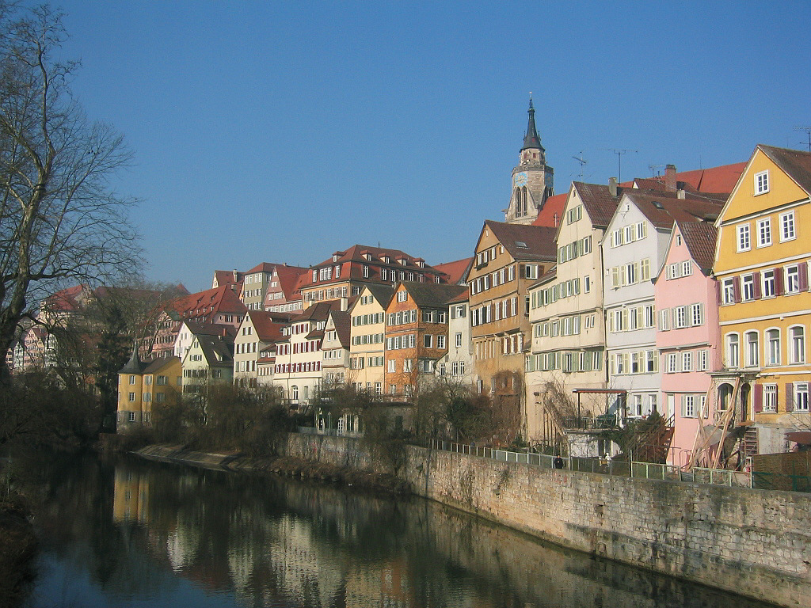
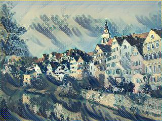
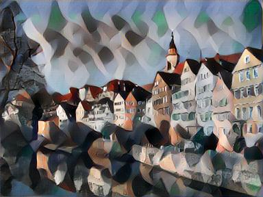
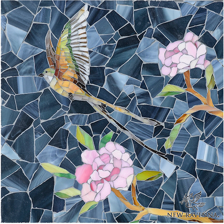
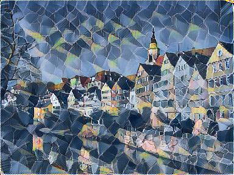
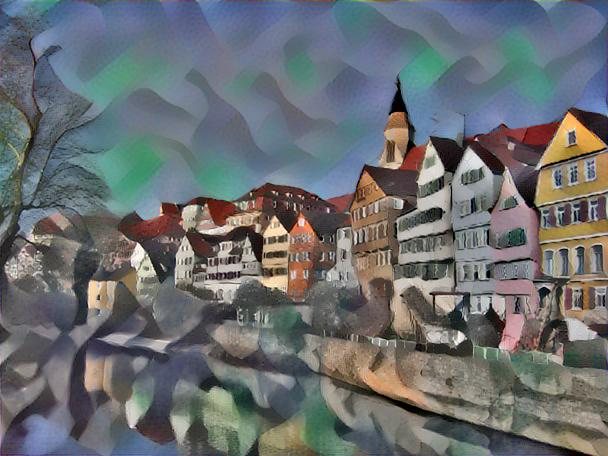
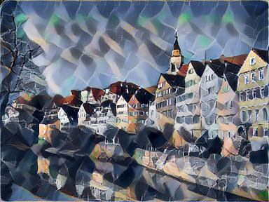

This is a Keras implementation of Fast-Neural-Style ([link](https://arxiv.org/abs/1603.08155))

## Results

<div align='center'>

</div>
<div align = 'center'>
<a href = 'examples/style_img/wave.png'></a>
<a href = 'examples/result_img/res_1.jpg'></a>
<br>
<a href = 'examples/style_img/udnie.jpg'></a>
<a href = 'examples/result_img/res_2.jpg'></a>
<br>
<a href = 'examples/style_img/bird.jpg'></a>
<a href = 'examples/result_img/res_3.jpg'></a>
</div>
You could also use it to train a network combining two different styles. Here are some results:

<div align = 'center'>
<a href = 'examples/result_img/res_4.jpg'></a>
<br>
<a href = 'examples/result_img/res_5.jpg'></a>
<br>
<a href = 'examples/result_img/res_6.jpg'></a>
</div>


These images are generated by combining two styles above.

## How to use it

For training the network:

```
python main.py -c ./configs/[config_name] -m train
```

For predicting:

```
python main.py -c ./configs/[config_name] -m predict -i [image_read_path] -o [image_save_path]
```

For viewing the baseline: ([link](https://arxiv.org/abs/1508.06576))

```
python main.py -c ./configs/[config_name] -m temp_view -i [image_read_path] -o [image_save_path] --iters [ITER]
```

The implementation of viewing base line is a little different from the original paper and shares the same loss net with training process, so you could use this temp_view function to adjust the hyperparameters.

For training the network, you should download [COCO dataset](http://msvocds.blob.core.windows.net/coco2014/train2014.zip) first and unzip it to the `train_image_path`, which is specified in the config files.

Here is the explanation for parameters in config files:

- `"net_name"`: the name of your style transferring net. weights will be saved according to the name of the network;
- `"learning_rate"`: learning rate of the Adam optimizer. It is set to 1e-3, as recommended in the original paper;
- `"content_weight"`: the weight of content loss;
- `"style_weight"`: the weight of style loss;
- `"total_variation_weight"`: the weight of total variation loss;
- `"train_image_height"` / `"train_image_width"`: All of images in the training set will be resized to pre-defined height and width. It's set to 256/256 as recommended in the original paper;
- `"plot_model"`: If it's set to true, the program will use `pyplot` to plot the model and save the graph;
- `"content_layer"`: the layer for computing content loss. Please do not change it;
- `"style_layer"`: a list, specified the layer for computing style loss. Please do not change it;
- `"style_image_path"`: the path to style image;
- `"style_image_path_2"`: the path to another style image. If exists the program will get results by combining two different styles;
- `"test_image_path"`: the path to test image. You could use this option to validate the training process;
- `"test_res_save_path"`: All test results will be saved to this path.

## Performance

It takes about 8 hours to train a network on a Nvidia K80 GPU. After training, predicting will be really fast and only use less than one second.
